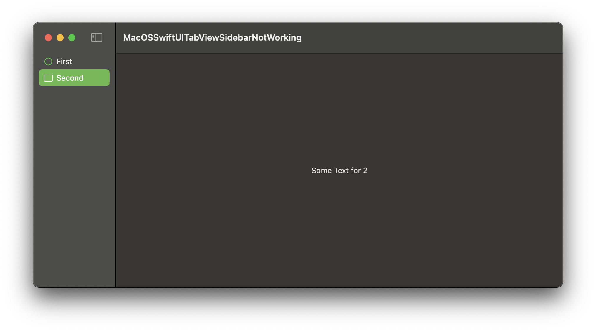

# FB15680632 - SwiftUI macOS: TabView sidebarAdaptable clicking label does not select

## Scenario

A macOS app with SwiftUI using a TabView with .tabViewStyle(.sidebarAdaptable).

## Issue

When clicking the text of an item in the sidebar, the item does not get selected. Only when clicking on the background, the selection works.

	
## Example code

The example shows a TabView that is displayed as a SplitView on macOS.

  

## Tested on

	- Xcode Version 16.1 (16B40) on macOS 15.1 (24B83)
